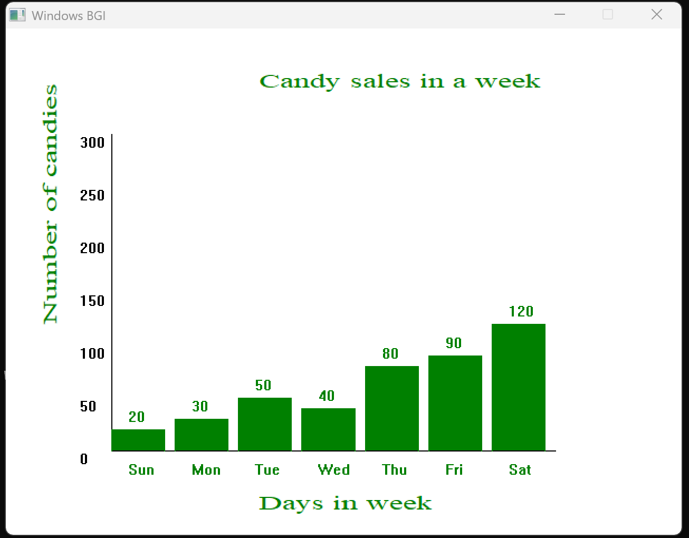
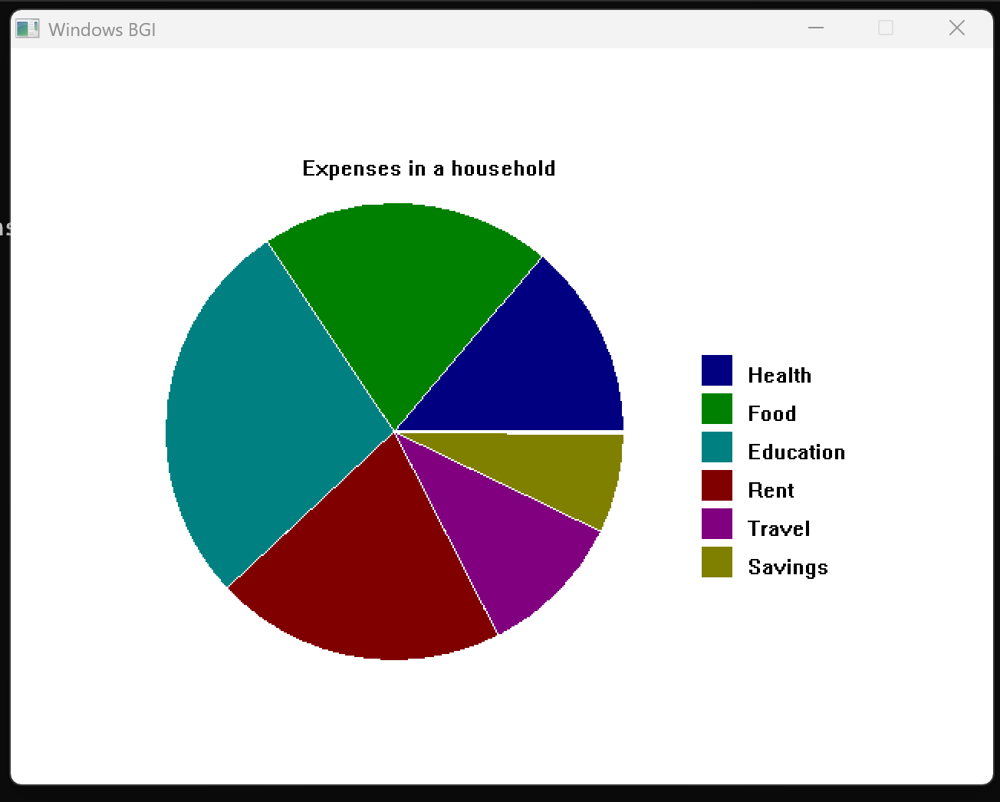
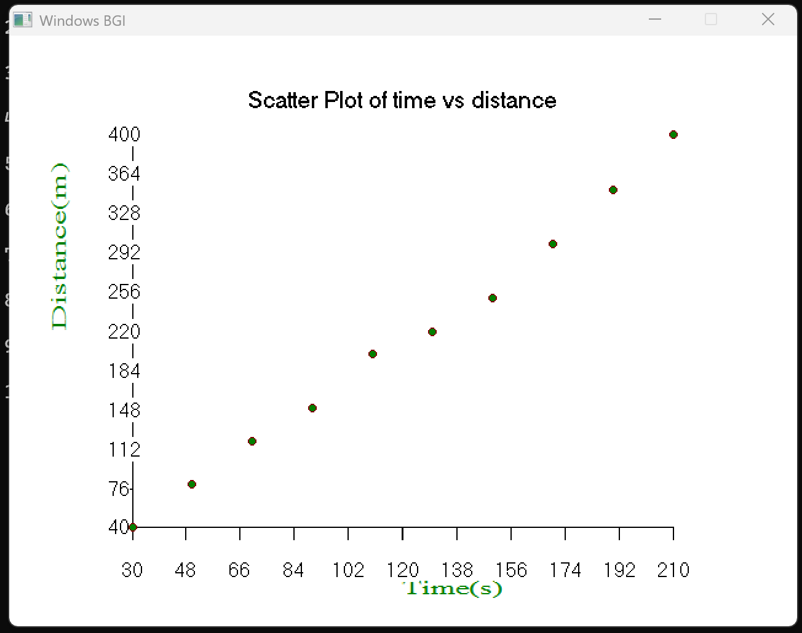
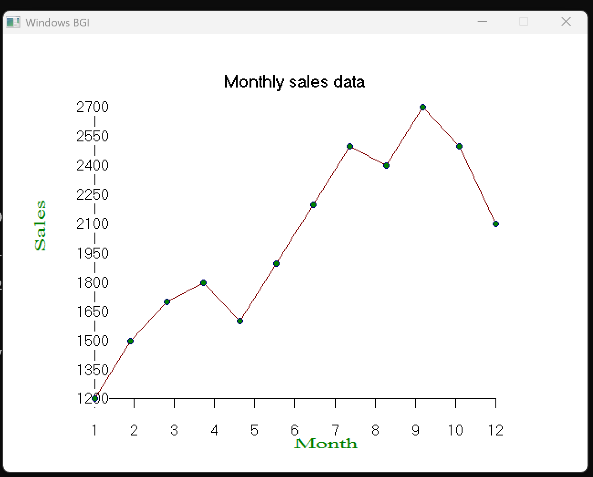

# 2D-Visualization
## Project Overview
This project is a simple 2D data visualization dashboard built using C++ and the graphics.h library. It allows users to create various types of data visualizations including bar charts, pie charts, line graphs, scatter plots, and Bezier curves. The application processes user input data and renders graphical representations through a menu-driven interface.

### Main Program Flow
```
┌─────────────┐
│    Start    │
└──────┬──────┘
       │
┌──────▼──────┐
│  Initialize  │
│  Graphics    │
└──────┬──────┘
       │
┌──────▼──────┐
│   Display    │
│    Menu      │
└──────┬──────┘
       │
┌──────▼──────┐
│  Get User    │
│   Choice     │
└──────┬──────┘
       │
┌──────▼──────┐
│ Process      │
│ Selection    │
└──────┬──────┘
       │
┌──────▼──────┐       ┌─────────────┐
│   Choice     │─Yes──►  Bar Graph   │
│    == 1?     │       └─────────────┘
└──────┬──────┘
    No │
┌──────▼──────┐       ┌─────────────┐
│   Choice     │─Yes──►  Pie Chart   │
│    == 2?     │       └─────────────┘
└──────┬──────┘
    No │
┌──────▼──────┐       ┌─────────────┐
│   Choice     │─Yes──►  Line Graph  │
│    == 3?     │       └─────────────┘
└──────┬──────┘
    No │
┌──────▼──────┐       ┌─────────────┐
│   Choice     │─Yes──►  Scatter     │
│    == 4?     │       │  Plot       │
└──────┬──────┘       └─────────────┘
    No │
┌──────▼──────┐       ┌─────────────┐
│   Choice     │─Yes──►   Bezier     │
│    == 5?     │       │   Curve     │
└──────┬──────┘       └─────────────┘
    No │
┌──────▼──────┐
│   Choice     │─Yes──┐
│    == 6?     │      │
└──────┬──────┘      │
    No │             │
       │             │
       └─────────────┘
       │
┌──────▼──────┐
│  Close       │
│  Graphics    │
└──────┬──────┘
       │
┌──────▼──────┐
│     End      │
└─────────────┘
```
### Outputs




