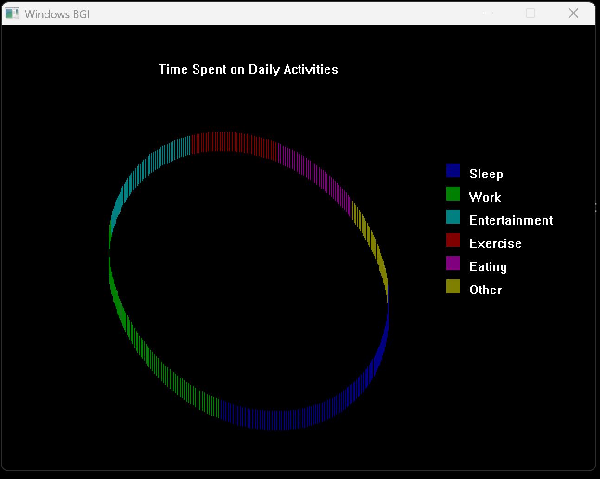
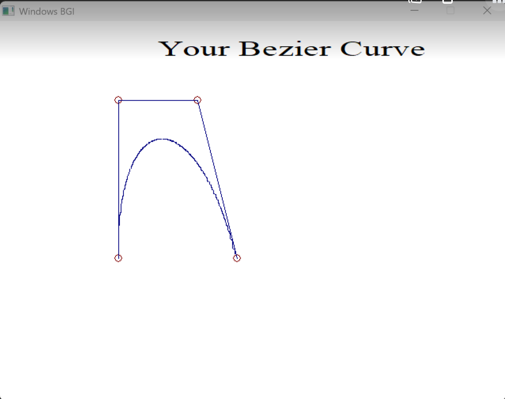

# 2D-Visualization
## Project Overview
As a part of our Computer Graphics project, we have developed a simple 2D data visualization dashboard using C++ and the graphics.h library. This application allows users to create various types of data visualizations, including bar charts, pie charts, line graphs, scatter plots, and Bezier curves. The system processes user input data and generates graphical representations through a menu-driven interface, making data visualization intuitive and interactive.

### Main Program Flow
```
┌─────────────┐
│    Start    │
└──────┬──────┘
       │
┌──────▼──────┐
│  Initialize │
│  Graphics   │
└──────┬──────┘
       │
┌──────▼──────┐
│   Display   │
│    Menu     │
└──────┬──────┘
       │
┌──────▼──────┐
│  Get User   │
│   Choice    │
└──────┬──────┘
       │
┌──────▼──────┐
│ Process     │
│ Selection   │
└──────┬──────┘
       │
┌──────▼──────┐      ┌─────────────┐
│   Choice    │─Yes──►  Bar Graph  │
│    == 1?    │      └─────────────┘
└──────┬──────┘
    No │
┌──────▼──────┐       ┌─────────────┐       ┌─────────────┐         ┌─────────────┐
│   Choice    │─Yes──►  Pie Chart   │ _____ │ Choice2==1? │ ─Yes──► |2D Pie Chart |
│    == 2?    │       └─────────────┘       └─────────────┘         └─────────────┘
└──────┬──────┘                                    |
    No │                                        No │
┌──────▼──────┐       ┌─────────────┐      ┌─────────────┐
│   Choice     │─Yes──►  Line Graph │      |3D Pie Chart |
│    == 3?     │      └─────────────┘      └─────────────┘
└──────┬──────┘
    No │
┌──────▼──────┐       ┌─────────────┐
│   Choice    │─Yes──►  Scatter     │
│    == 4?    │       │  Plot       │
└──────┬──────┘       └─────────────┘
    No │
┌──────▼──────┐       ┌─────────────┐
│   Choice    │─Yes──►   Bezier     │
│    == 5?    │       │   Curve     │
└──────┬──────┘       └─────────────┘
    No │
┌──────▼──────┐
│   Choice    │─Yes──┐
│    == 6?    │      │
└──────┬──────┘      │
    No │             │
       │             │
       └─────────────┘
       │
┌──────▼──────┐
│  Close      │
│  Graphics   │
└──────┬──────┘
       │
┌──────▼──────┐
│     End     │
└─────────────┘
```
### Outputs






## Contributors

- [Shristi Pokhrel](https://github.com/Shri-29)
- [Shruti Maharjan](https://github.com/shruti-1007)
- [Swarnima Khadka](https://github.com/Swarnima-Khadka)
- [Yurisha Bajracharya](https://github.com/yurisha-bajracharya)
